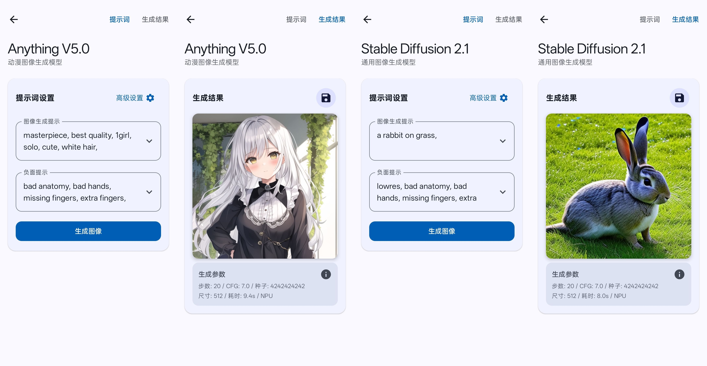

# Local Dream 

Android Stable Diffusion with Snapdragon NPU acceleration. Also supports CPU inference.

## About this Repo

This project is **currently closed-source** and this repository is only used for releasing binaries and discussing issues for now.

This project is **completely free**. Hope you enjoy it!

## Usage

- Download the APK from the [Releases](https://github.com/xororz/local-dream/releases) page
- Open the app and download the model(s) you want to use

## Technical Implementation

### NPU Acceleration

- Utilizes Qualcomm QNN SDK to leverage Hexagon NPU
- W8A16 static quantization for optimal performance
- Fixed model shape at 512x512
- Extremely fast inference speed

### CPU Inference

- Powered by MNN framework
- W8 dynamic quantization
- Flexible output sizes: 128x128, 256x256, 384x384, 512x512
- Relatively slower processing speed with slightly lower accuracy

## Supported Devices

### NPU Acceleration Support

- Devices with Snapdragon 8 Gen 1
- Devices with Snapdragon 8+Gen 1
- Devices with Snapdragon 8 Gen 2
- Devices with Snapdragon 8 Gen 3
- Devices with Snapdragon 8 Gen 4

Other devices are not able to download the npu models.

Note: Different phones have different default frequency limits for their NPUs, and the same chip from different manufacturers may have varying inference speeds.

### CPU Support

- Requires approximately 2GB RAM
- Compatible with most Android phones from recent years

## Available Models

1. Anything V5.0

   - Specialized for anime/manga style image generation

2. Stable Diffusion 2.1

   - General-purpose image generation

3. Pony V5.5
   - Pony Diffusion series

Currently CPU version only provides Anything V5.0 model since it works fine at low resolutions.

## Seed Settings

The application supports custom seed settings for reproducible results:

- CPU Mode: Seeds guarantee identical results across different devices with the same parameters
- NPU Mode: Seeds ensure consistent results only on devices with identical chipsets

## Sponsorship

If you like this project, please consider sponsoring this it. Your support will help me implement:

- Additional models
- New features
- Enhanced capabilities

<!-- 
 -->

Your sponsorship helps maintain and improve Local Dream for everyone!
