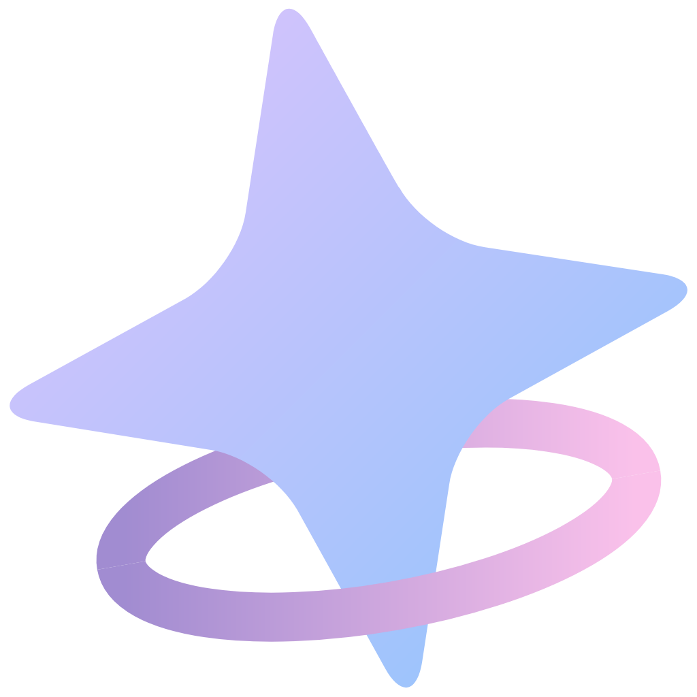
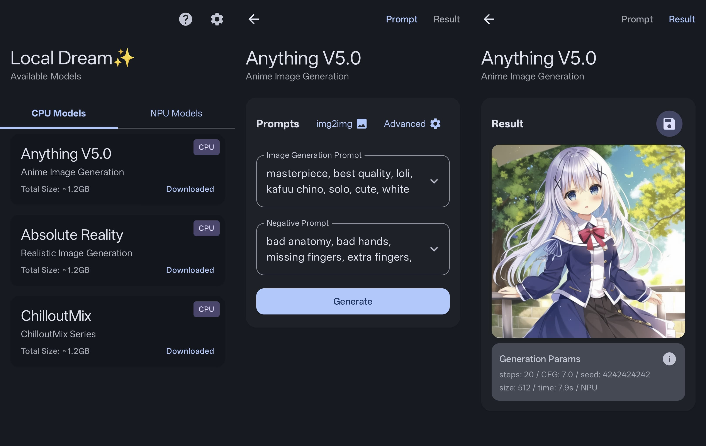
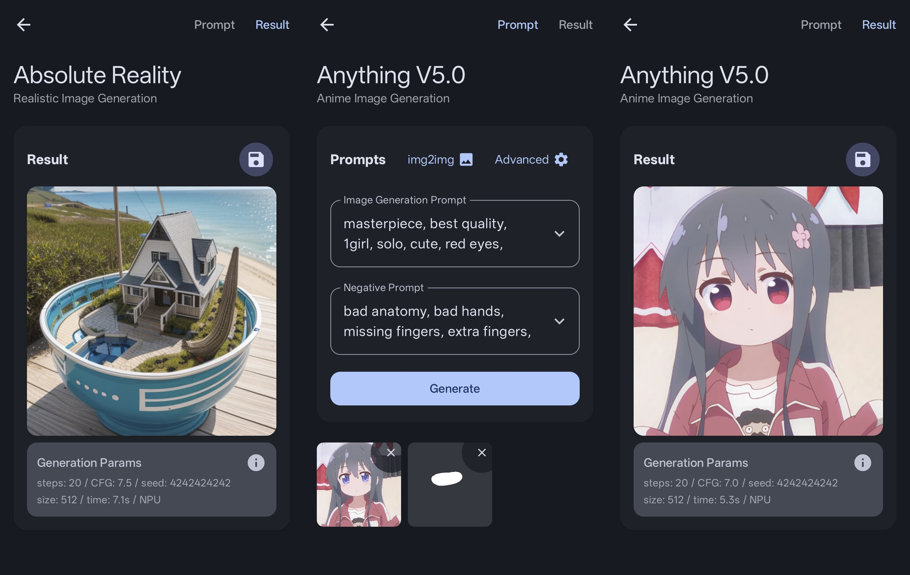

<div align="center">

# Local Dream 

**Android Stable Diffusion with Snapdragon NPU acceleration**  
_Also supports CPU/GPU inference_



</div>

## About this Repo

This project is **now open sourced and completely free**. Hope you enjoy it!

If you like it, please consider [sponsor](https://github.com/xororz/local-dream?tab=readme-ov-file#-support-this-project) this project.

## 🚀 Quick Start

1. **Download**: Get the APK from [Releases](https://github.com/xororz/local-dream/releases) or [Google Play](https://play.google.com/store/apps/details?id=io.github.xororz.localdream)(NSFW filtered)
2. **Install**: Install the APK on your Android device
3. **Select Models**: Open the app and download the model(s) you want to use

## ✨ Features

- 🎨 **txt2img** - Generate images from text descriptions
- 🖼️ **img2img** - Transform existing images
- 🎭 **inpaint** - Redraw selected areas of images

<div align="center">

</div>

## 🔧 Build Instructions

> **Note**: Building on Linux/WSL is recommended. Other platforms are not verified.

### Prerequisites

The following tools are required for building:

- **Rust** - Install [rustup](https://rustup.rs/), then run:
  ```bash
  rustup default stable
  rustup target add aarch64-linux-android
  ```
- **Ninja** - Build system
- **CMake** - Build configuration

### 1. Clone Repository

```bash
git clone --recursive https://github.com/xororz/local-dream.git
```

### 2. Prepare SDKs

1. **Download QNN SDK**: Get [QNN_SDK_2.29](https://apigwx-aws.qualcomm.com/qsc/public/v1/api/download/software/qualcomm_neural_processing_sdk/v2.29.0.241129.zip) and extract
2. **Download Android NDK**: Get [Android NDK](https://developer.android.com/ndk/downloads) and extract
3. **Configure paths**:
   - Update `QNN_SDK_ROOT` in `app/src/main/cpp/CMakeLists.txt`
   - Update `ANDROID_NDK_ROOT` in `app/src/main/cpp/CMakePresets.json`

### 3. Build Libraries

<details>
<summary><strong>🐧 Linux</strong></summary>

```bash
cd app/src/main/cpp/
bash ./build.sh
```

</details>

<details>
<summary><strong>🪟 Windows</strong></summary>

```powershell
# Install dependencies if needed:
# winget install Kitware.CMake
# winget install Ninja-build.Ninja
# winget install Rustlang.Rustup

cd app\src\main\cpp\

# Convert patch file (install dos2unix if needed: winget install -e --id waterlan.dos2unix)
dos2unix SampleApp.patch
.\build.bat
```

</details>

<details>
<summary><strong>🍎 macOS</strong></summary>

```bash
# Install dependencies with Homebrew:
# brew install cmake rust ninja

# Fix CMake version compatibility
sed -i '' '2s/$/ -DCMAKE_POLICY_VERSION_MINIMUM=3.5/' build.sh
bash ./build.sh
```

</details>

### 4. Build APK

Open this project in Android Studio and navigate to:
**Build → Generate App Bundles or APKs → Generate APKs**

## Technical Implementation

### NPU Acceleration

- **SDK**: Qualcomm QNN SDK leveraging Hexagon NPU
- **Quantization**: W8A16 static quantization for optimal performance
- **Resolution**: Fixed 512×512 model shape
- **Performance**: Extremely fast inference speed

### CPU/GPU Inference

- **Framework**: Powered by MNN framework
- **Quantization**: W8 dynamic quantization
- **Resolution**: Flexible sizes (128×128, 256×256, 384×384, 512×512)
- **Performance**: Moderate speed with high compatibility

## NPU High Resolution Support

After downloading a 512 resolution model, you can download patches to enable 768×768 and 1024×1024 image generation. Please note that quantized high-resolution models may produce images with poor layout. We recommend first generating at 512 resolution, then using the high-resolution model for img2img (which is essentially Highres.fix). The suggested img2img denoise_strength is around 0.75.

## Device Compatibility

### NPU Acceleration Support

Compatible with devices featuring:

- **Snapdragon 8 Gen 1**
- **Snapdragon 8+ Gen 1**
- **Snapdragon 8 Gen 2**
- **Snapdragon 8 Gen 3**
- **Snapdragon 8 Elite**

> **Note**: Other devices cannot download NPU models

### CPU/GPU Support

- **RAM Requirement**: ~2GB available memory
- **Compatibility**: Most Android devices from recent years

## Available Models

Now supports importing from local SD1.5 based safetensor for CPU/GPU.

<div align="center">

| Model                    | Type  | CPU/GPU | NPU | Clip Skip | Source                                                                              |
| ------------------------ | ----- | :-----: | :-: | :-------: | ----------------------------------------------------------------------------------- |
| **Anything V5.0**        | SD1.5 |   ✅    | ✅  |     2     | [CivitAI](https://civitai.com/models/9409?modelVersionId=30163)                     |
| **ChilloutMix**          | SD1.5 |   ✅    | ✅  |     1     | [CivitAI](https://civitai.com/models/6424/chilloutmix?modelVersionId=11732)         |
| **Absolute Reality**     | SD1.5 |   ✅    | ✅  |     2     | [CivitAI](https://civitai.com/models/81458?modelVersionId=132760)                   |
| **QteaMix**              | SD1.5 |   ✅    | ✅  |     2     | [CivitAI](https://civitai.com/models/50696/qteamix-q?modelVersionId=94654)          |
| **CuteYukiMix**          | SD1.5 |   ✅    | ✅  |     2     | [CivitAI](https://civitai.com/models/28169?modelVersionId=265102)                   |
| **Stable Diffusion 2.1** | SD2.1 |   ❌    | ✅  |     1     | [HuggingFace](https://huggingface.co/stabilityai/stable-diffusion-2-1/tree/main)    |
| **Pony V5.5**            | SD2.1 |   ❌    | ✅  |     1     | [CivitAI](https://civitai.com/models/95367/pony-diffusion-v5?modelVersionId=205936) |

</div>

## 🎲 Seed Settings

Custom seed support for reproducible image generation:

- **CPU Mode**: Seeds guarantee identical results across different devices with same parameters
- **GPU Mode**: Results may differ from CPU mode and can vary between different devices
- **NPU Mode**: Seeds ensure consistent results only on devices with identical chipsets

## Credits & Acknowledgments

### C++ Libraries

- **[Qualcomm QNN SDK](https://www.qualcomm.com/developer/software/neural-processing-sdk-for-ai)** - NPU model execution
- **[alibaba/MNN](https://github.com/alibaba/MNN/)** - CPU model execution
- **[xtensor-stack](https://github.com/xtensor-stack)** - Tensor operations & scheduling
- **[mlc-ai/tokenizers-cpp](https://github.com/mlc-ai/tokenizers-cpp)** - Text tokenization
- **[yhirose/cpp-httplib](https://github.com/yhirose/cpp-httplib)** - HTTP server
- **[nothings/stb](https://github.com/nothings/stb)** - Image processing
- **[facebook/zstd](https://github.com/facebook/zstd)** - Model compression
- **[nlohmann/json](https://github.com/nlohmann/json)** - JSON processing

### Android Libraries

- **[coil-kt/coil](https://github.com/coil-kt/coil)** - Image loading & processing
- **[MoyuruAizawa/Cropify](https://github.com/MoyuruAizawa/Cropify)** - Image cropping
- **AOSP, Material Design, Jetpack Compose** - UI framework

### NSFW Detection Model

- **[bhky/opennsfw2](https://github.com/bhky/opennsfw2)** - NSFW content filtering

---

## 💖 Support This Project

If you find Local Dream useful, please consider supporting its development:

### What Your Support Helps With:

- **Additional Models** - More AI model integrations
- **New Features** - Enhanced functionality and capabilities
- **Bug Fixes** - Continuous improvement and maintenance

<a href="https://ko-fi.com/xororz">
    
</a>
<a href="https://afdian.com/a/xororz">
    
</a>

Your sponsorship helps maintain and improve Local Dream for everyone!

</div>
